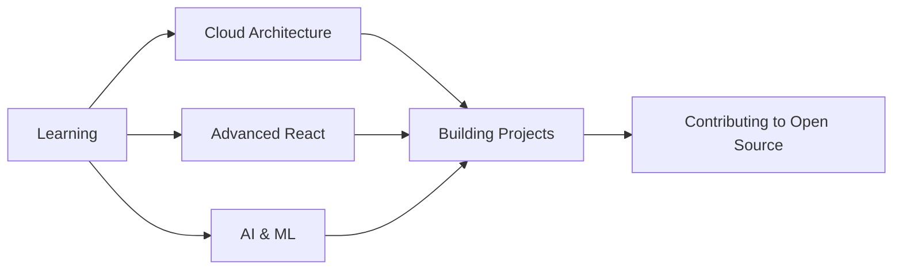

# <div align="center">👨‍💻 Vivek Khara | Full Stack Developer & Tech Enthusiast</div>

<div align="center">
  
</div>

<div align="center">
  
  
</div>

---

## 🚀 About Me

```javascript
const vivekKhara = {
    location: "Navsari, Gujarat, India",
    currentRole: "Freelance Software Developer",
    passions: ["Web Development", "Mobile Apps", "Problem Solving", "Open Source"],
    currentlyLearning: ["Cloud Architecture", "Advanced React Patterns", "AI/ML"],
    lookingToCollaborate: "Innovative projects that make a difference",
    funFact: "I debug with console.log() and I'm not ashamed! 😄"
};
```


### 💼 What I Do

- 🔭 Building scalable **web and mobile applications**
- 🌱 Exploring **cloud technologies** and **DevOps practices**
- 👯 Open to collaborate on **innovative projects**
- 💬 Ask me about **React, Node.js, Python, or anything tech**
- ⚡ **Fun fact:** I can code for hours with just coffee and music!

---

## 🛠️ Tech Stack & Tools

<div align="center">

### Frontend Development


### Backend Development


### Programming Languages


### Database & Storage


### Tools & Platforms


</div>

---

## 📊 GitHub Statistics

<div align="center">
  
  
</div>

<div align="center">
  
  
</div>

---

## 🏆 GitHub Trophies

<div align="center">
  
</div>

---

## 📈 Contribution Graph

<div align="center">
  
</div>

---

## 🎯 Current Focus

<div align="center">



</div>

---

## 🤝 Connect With Me

<div align="center">
  
[](https://linkedin.com/in/Vivek-Khara)
[](mailto:vivekkhara800@gmail.com)
[](https://github.com/Vivek635229)

</div>

---

## 💡 Quote of the Day

<div align="center">
  
</div>

---

## 🐍 Contribution Snake

<div align="center">
  
</div>

---

<div align="center">
  
### 💻 "Code is like humor. When you have to explain it, it's bad!" – Cory House

### ⭐ From [Vivek Khara](https://github.com/Vivek635229) | Made with ❤️ and ☕

</div>

---

<div align="center">
  
</div>
