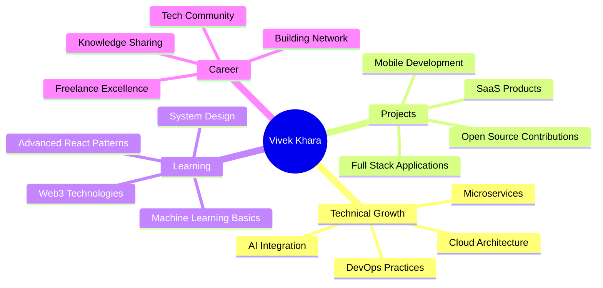

<div align="center">

<!-- Professional Header Banner -->


<!-- Profile Picture with Border -->


<br/>
<br/>

<!-- Professional Badges -->
[](https://linkedin.com/in/Vivek-Khara)
[](mailto:vivekkhara800@gmail.com)
[](https://github.com/Vivek635229)
[](#)

<br/>

<!-- Animated Typing Effect -->
[](https://git.io/typing-svg)

<!-- Profile Views Counter -->


</div>

<br/>

---

<br/>

<div align="center">

## 💼 Professional Summary

</div>

<table align="center">
<tr>
<td width="50%" valign="top">

### 🎯 About Me

```yaml
name: Vivek Khara
location: Navsari, Gujarat, India
role: Full Stack Developer & Software Engineer
status: Freelance & Open for Opportunities
experience: Web & Mobile Application Development
specialty: End-to-End Solution Architecture

interests:
  - Clean Code Architecture
  - Scalable Systems
  - Modern Web Technologies
  - Mobile-First Design
  - Cloud Infrastructure
```

</td>
<td width="50%" valign="top">

### 🚀 What I Bring

```typescript
const skills = {
  frontend: ["React", "React Native", "UI/UX"],
  backend: ["Node.js", "Express", "Python", ".NET"],
  databases: ["MongoDB", "MySQL", "SQL Server"],
  languages: ["JavaScript", "Python", "Java", "C#", "PHP"],
  tools: ["Git", "GitHub", "VS Code", "Postman"],
  expertise: "Full-Stack Development",
  approach: "Quality-Driven & Client-Focused"
};
```

</td>
</tr>
</table>

<br/>

---

<br/>

<div align="center">

## 🛠️ Technology Arsenal

### **Frontend Excellence**

<table>
<tr>
<td align="center" width="96">

<br>React
</td>
<td align="center" width="96">

<br>JavaScript
</td>
<td align="center" width="96">

<br>HTML5
</td>
<td align="center" width="96">

<br>CSS3
</td>
<td align="center" width="96">

<br>Tailwind
</td>
<td align="center" width="96">

<br>Bootstrap
</td>
</tr>
</table>

### **Backend & Server**

<table>
<tr>
<td align="center" width="96">

<br>Node.js
</td>
<td align="center" width="96">

<br>Express
</td>
<td align="center" width="96">

<br>Python
</td>
<td align="center" width="96">

<br>PHP
</td>
<td align="center" width="96">

<br>.NET
</td>
<td align="center" width="96">

<br>C#
</td>
</tr>
</table>

### **Programming Languages**

<table>
<tr>
<td align="center" width="96">

<br>Java
</td>
<td align="center" width="96">

<br>C
</td>
<td align="center" width="96">

<br>C++
</td>
<td align="center" width="96">

<br>Python
</td>
<td align="center" width="96">

<br>JavaScript
</td>
<td align="center" width="96">

<br>TypeScript
</td>
</tr>
</table>

### **Database Management**

<table>
<tr>
<td align="center" width="96">

<br>MongoDB
</td>
<td align="center" width="96">

<br>MySQL
</td>
<td align="center" width="96">

<br>PostgreSQL
</td>
<td align="center" width="96">

<br>Firebase
</td>
</tr>
</table>

### **Tools & Platforms**

<table>
<tr>
<td align="center" width="96">

<br>Git
</td>
<td align="center" width="96">

<br>GitHub
</td>
<td align="center" width="96">

<br>VS Code
</td>
<td align="center" width="96">

<br>Postman
</td>
<td align="center" width="96">

<br>Docker
</td>
<td align="center" width="96">

<br>Linux
</td>
</tr>
</table>

</div>

<br/>

---

<br/>

<div align="center">

## 📊 GitHub Performance Analytics

<br/>

<!-- GitHub Stats Cards -->


<br/>
<br/>

<!-- Language Stats & Contribution Graph -->


</div>

<br/>

---

<br/>

<div align="center">

## 🏆 Achievements & Recognition

<br/>


</div>

<br/>

---

<br/>

<div align="center">

## 💡 Development Philosophy

</div>

<table align="center">
<tr>
<td width="33%" align="center">

### 🎨 Design First
**User-Centric Approach**

Building intuitive interfaces that users love to interact with

</td>
<td width="33%" align="center">

### ⚡ Performance Driven
**Speed & Efficiency**

Optimizing every line of code for maximum performance

</td>
<td width="33%" align="center">

### 🔒 Security Focused
**Best Practices**

Implementing industry-standard security protocols

</td>
</tr>
</table>

<br/>

---

<br/>

<div align="center">

## 🎯 Current Focus & Goals

</div>



<br/>

---

<br/>

<div align="center">

## 📈 Weekly Development Breakdown

<!--START_SECTION:waka-->
<!--END_SECTION:waka-->

</div>

<br/>

---

<br/>

<div align="center">

## 🤝 Let's Connect & Collaborate

<br/>

### **Open for:**
✅ Freelance Projects | ✅ Full-Time Opportunities | ✅ Technical Collaborations | ✅ Open Source Contributions

<br/>

<!-- Contact Cards -->
<table>
<tr>
<td align="center">
<a href="https://linkedin.com/in/Vivek-Khara" target="_blank">

<br/>
<strong>Professional Network</strong>
</a>
</td>
<td align="center">
<a href="mailto:vivekkhara800@gmail.com">

<br/>
<strong>Direct Contact</strong>
</a>
</td>
<td align="center">
<a href="https://github.com/Vivek635229" target="_blank">

<br/>
<strong>Code Repository</strong>
</a>
</td>
</tr>
</table>

<br/>

### 📧 **Email:** vivekkhara800@gmail.com
### 📍 **Location:** Navsari, Gujarat, India
### 💼 **Status:** Available for Exciting Opportunities

</div>

<br/>

---

<br/>

<div align="center">

## 💭 Professional Quote

<br/>


<br/>
<br/>

### *"Code is poetry written in logic, where every function tells a story and every algorithm solves a problem."*

</div>

<br/>

---

<br/>

<div align="center">

## 🐍 Contribution Activity

<picture>
  <source media="(prefers-color-scheme: dark)" srcset="https://raw.githubusercontent.com/Vivek635229/Vivek635229/output/github-contribution-grid-snake-dark.svg">
  <source media="(prefers-color-scheme: light)" srcset="https://raw.githubusercontent.com/Vivek635229/Vivek635229/output/github-contribution-grid-snake.svg">
  
</picture>

</div>

<br/>

---

<br/>

<div align="center">

### 📊 Detailed Contribution Stats


</div>

<br/>

---

<br/>

<div align="center">

## ⭐ Show Some Love

**If you find my work valuable, consider:**

[](https://github.com/Vivek635229?tab=repositories)
[](https://github.com/Vivek635229)
[](https://github.com/sponsors/Vivek635229)

<br/>

### 🌟 *"Every star, follow, and contribution motivates me to build better solutions!"*

</div>

<br/>

---

<br/>

<div align="center">


<br/>

**Made with ❤️ by Vivek Khara** | **© 2025 All Rights Reserved**

<br/>


</div>
