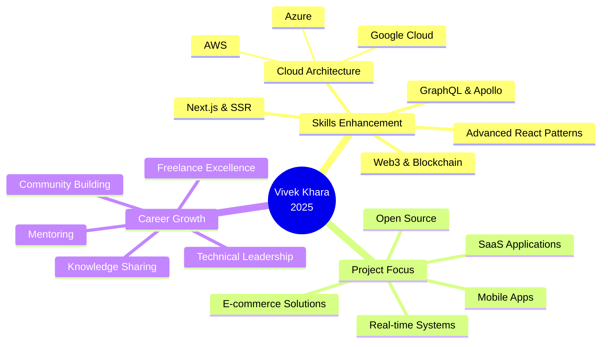

<div align="center">

<!-- DIRECT URL BANNER - NO UPLOAD NEEDED! -->


<!-- Profile Photo with Overlap Effect -->


<br/>
<br/>

<!-- Animated Typing Effect -->
[](https://git.io/typing-svg)

<br/>

<!-- Social Badges -->
<p align="center">
  <a href="https://linkedin.com/in/Vivek-Khara" target="_blank">
    
  </a>
  <a href="mailto:vivekkhara800@gmail.com">
    
  </a>
  <a href="https://github.com/Vivek635229" target="_blank">
    
  </a>
  <a href="#" target="_blank">
    
  </a>
</p>

<!-- Stats Badges -->
<p align="center">
  
  
  
</p>

</div>

<br/>

---

<br/>

<div align="center">

## 👨‍💼 Professional Overview

</div>

<table width="100%">
<tr>
<td width="60%" valign="top">

### 🎯 About Me

<p align="justify">
Passionate <strong>Software Developer</strong> and <strong>Full Stack Engineer</strong> with expertise in building robust, scalable web and mobile applications. Based in <strong>Navsari, Gujarat, India</strong>, I specialize in transforming complex business requirements into elegant technical solutions.
</p>

<p align="justify">
Currently working as a <strong>Freelance Developer</strong>, I bring a comprehensive skill set spanning frontend, backend, and database technologies. My approach combines clean code principles with modern development practices to deliver high-quality, maintainable software solutions.
</p>

#### 💼 **Current Focus:**
- 🔹 Building scalable full-stack applications
- 🔹 Mobile-first responsive development
- 🔹 Cloud architecture & deployment
- 🔹 Open source contributions
- 🔹 Continuous learning & innovation

#### 🎓 **Core Competencies:**
- **Frontend:** React, React Native, Modern UI/UX
- **Backend:** Node.js, Python, .NET, PHP
- **Database:** MongoDB, MySQL, SQL Server
- **DevOps:** Git, GitHub, Docker, Cloud Platforms

</td>
<td width="40%" valign="top">

### 📊 Quick Stats

<br/>

```
📍 Location:        Navsari, Gujarat, India
💼 Role:            Software Developer
🎯 Specialization:  Full Stack Development
📧 Email:           vivekkhara800@gmail.com
🌐 Status:          Open for Opportunities
```

<br/>

#### 🏆 **Highlights:**

<table>
<tr>
<td align="center">

<br/><strong>10+</strong>
<br/><sub>Technologies</sub>
</td>
<td align="center">

<br/><strong>Full Stack</strong>
<br/><sub>Development</sub>
</td>
<td align="center">

<br/><strong>Freelance</strong>
<br/><sub>Expert</sub>
</td>
</tr>
</table>

<br/>

#### 💡 **Philosophy:**

> *"Quality code is not written, it's crafted with passion, tested with precision, and deployed with confidence."*

</td>
</tr>
</table>

<br/>

---

<br/>

<div align="center">

## 🛠️ Technical Expertise

</div>

###  **Frontend Technologies**

<p align="center">
  
</p>

<table align="center">
<tr>
<td align="center" width="25%">
<strong>⚛️ React.js</strong><br/>
<sub>Component-based UI development</sub>
</td>
<td align="center" width="25%">
<strong>📱 React Native</strong><br/>
<sub>Cross-platform mobile apps</sub>
</td>
<td align="center" width="25%">
<strong>🎨 Modern CSS</strong><br/>
<sub>Responsive & adaptive design</sub>
</td>
<td align="center" width="25%">
<strong>⚡ JavaScript</strong><br/>
<sub>ES6+ & TypeScript ready</sub>
</td>
</tr>
</table>

<br/>

###  **Backend & Server-Side**

<p align="center">
  
</p>

<table align="center">
<tr>
<td align="center" width="25%">
<strong>🟢 Node.js</strong><br/>
<sub>Scalable server applications</sub>
</td>
<td align="center" width="25%">
<strong>🐍 Python</strong><br/>
<sub>Backend & automation</sub>
</td>
<td align="center" width="25%">
<strong>⚙️ .NET Core</strong><br/>
<sub>Enterprise solutions</sub>
</td>
<td align="center" width="25%">
<strong>☕ Java</strong><br/>
<sub>Object-oriented programming</sub>
</td>
</tr>
</table>

<br/>

###  **Database Management**

<p align="center">
  
</p>

<table align="center">
<tr>
<td align="center" width="33%">
<strong>🍃 MongoDB</strong><br/>
<sub>NoSQL document database</sub>
</td>
<td align="center" width="33%">
<strong>🐬 MySQL</strong><br/>
<sub>Relational database systems</sub>
</td>
<td align="center" width="33%">
<strong>🔥 Firebase</strong><br/>
<sub>Real-time cloud database</sub>
</td>
</tr>
</table>

<br/>

###  **Development Tools & Platforms**

<p align="center">
  
</p>

<table align="center">
<tr>
<td align="center" width="25%">
<strong>📦 Git & GitHub</strong><br/>
<sub>Version control expert</sub>
</td>
<td align="center" width="25%">
<strong>💻 VS Code</strong><br/>
<sub>Primary development IDE</sub>
</td>
<td align="center" width="25%">
<strong>🐳 Docker</strong><br/>
<sub>Containerization</sub>
</td>
<td align="center" width="25%">
<strong>📮 Postman</strong><br/>
<sub>API testing & documentation</sub>
</td>
</tr>
</table>

<br/>

---

<br/>

<div align="center">

## 📊 GitHub Analytics & Performance

<br/>

<!-- GitHub Stats Card -->
<a href="https://github.com/Vivek635229">
  
</a>

<!-- Top Languages Card -->
<a href="https://github.com/Vivek635229">
  
</a>

<br/>
<br/>

<!-- GitHub Streak Stats - Multiple Fallbacks -->
<a href="https://github.com/Vivek635229">
  
</a>

<br/>
<br/>

<!-- Contribution Activity Graph -->


</div>

<br/>

---

<br/>

<div align="center">

## 🏆 GitHub Achievements

<br/>


</div>

<br/>

---

<br/>

<div align="center">

## 💼 Professional Approach

</div>

<table align="center" width="100%">
<tr>
<td width="25%" align="center" valign="top">


### Clean Code
**Readable & Maintainable**

Writing self-documenting code that follows industry best practices and design patterns

</td>
<td width="25%" align="center" valign="top">


### Performance
**Speed & Efficiency**

Optimizing applications for maximum performance and minimal resource consumption

</td>
<td width="25%" align="center" valign="top">


### Security
**Best Practices**

Implementing robust security measures and following OWASP guidelines

</td>
<td width="25%" align="center" valign="top">


### Testing
**Quality Assurance**

Comprehensive testing strategies ensuring reliable and bug-free deployments

</td>
</tr>
</table>

<br/>

---

<br/>

<div align="center">

## 🎯 Current Learning Path

</div>



<br/>

---

<br/>

<div align="center">

## 🤝 Let's Build Something Amazing Together

<br/>

### **Currently Available For:**

<table align="center">
<tr>
<td align="center" width="25%">

<br/><strong>Freelance Projects</strong>
<br/><sub>Custom development solutions</sub>
</td>
<td align="center" width="25%">

<br/><strong>Full-Time Roles</strong>
<br/><sub>Software development positions</sub>
</td>
<td align="center" width="25%">

<br/><strong>Collaborations</strong>
<br/><sub>Open source & side projects</sub>
</td>
<td align="center" width="25%">

<br/><strong>Consulting</strong>
<br/><sub>Technical guidance & reviews</sub>
</td>
</tr>
</table>

<br/>

### **📬 Get In Touch**

<p align="center">
  <a href="https://linkedin.com/in/Vivek-Khara" target="_blank">
    
  </a>
  <a href="mailto:vivekkhara800@gmail.com">
    
  </a>
</p>

<p align="center">
  <strong>📍 Location:</strong> Navsari, Gujarat, India<br/>
  <strong>💼 Status:</strong>  Open for Opportunities<br/>
  <strong>⏰ Response Time:</strong> Within 24 hours
</p>

</div>

<br/>

---

<br/>

<div align="center">

## 💭 Words to Code By

<br/>


<br/>
<br/>

### *"The best code is no code at all, but when you must write it, make it elegant, efficient, and maintainable."*

</div>

<br/>

---

<br/>

<div align="center">

## 🐍 Contribution Snake Animation

<br/>

<picture>
  <source media="(prefers-color-scheme: dark)" srcset="https://raw.githubusercontent.com/Platane/snk/output/github-contribution-grid-snake-dark.svg">
  <source media="(prefers-color-scheme: light)" srcset="https://raw.githubusercontent.com/Platane/snk/output/github-contribution-grid-snake.svg">
  
</picture>

<br/>

*Note: Snake animation is a visual representation of your GitHub contribution graph*

</div>

<br/>

---

<br/>

<div align="center">

## ⭐ Support My Work

<br/>

**If you find my projects valuable, I'd appreciate your support!**

<br/>

<a href="https://github.com/Vivek635229?tab=repositories" target="_blank">
  
</a>
<a href="https://github.com/Vivek635229" target="_blank">
  
</a>

<br/>
<br/>

### *Every star and follow motivates me to create better solutions!* 🚀

</div>

<br/>

---

<br/>

<div align="center">

<!-- Footer Wave -->


<br/>

**Crafted with 💙 by Vivek Khara** | **© 2025**

<br/>


</div>
