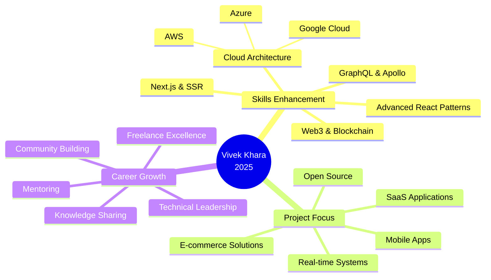

<!-- ANIMATED HEADER BANNER WITH CODING BACKGROUND -->

<!-- CODING ANIMATION BACKGROUND -->

<!-- Profile Photo with Enhanced Styling -->

 
 

<!-- Enhanced Animated Typing Effect with Professional Font -->

<!-- ANIMATED CODING GIF -->

 

<!-- Enhanced Social Badges with Animations -->

  
  
  
  

<!-- Enhanced Stats Badges with Fixed Profile Views -->

  
  
  

<!-- ANIMATED DIVIDER -->

 

---

 

<!-- ANIMATED TITLE WITH CODING THEME -->

## 👨‍💼 Professional Overview

  
  
  

  I am a <strong>Software Developer</strong> and <strong>Full Stack Engineer</strong> focused on building dependable, scalable, and user-friendly digital products.
  I convert business ideas into production-ready solutions with a strong emphasis on clean architecture, performance, and maintainability.

<table align="center" width="100%">
<tr>
<td width="50%" valign="top">

### 🚀 Focus Areas

- Building scalable full-stack web applications
- Designing mobile-first responsive interfaces
- Engineering secure and maintainable backend systems
- Delivering cloud-ready deployments and CI-friendly workflows
- Contributing to open source and continuous learning

</td>
<td width="50%" valign="top">

### 🧩 Professional Snapshot

- **Primary Role:** Freelance Software Developer
- **Specialization:** Full Stack Development
- **Tech Breadth:** Frontend, Backend, Databases, DevOps
- **Core Stack:** React, Node.js, Python, .NET, MongoDB, MySQL
- **Work Style:** Quality-first delivery with clear communication

</td>
</tr>
</table>

<strong>Philosophy:</strong> <em>Quality code is crafted with intent, validated with rigor, and shipped with confidence.</em>

 

---

 

## 🛠️ Technical Expertise

  
  
  

<table align="center" width="100%">
<tr>
<td width="50%" valign="top" align="center">

### Frontend Engineering

  

<strong>Core Focus:</strong> Component systems, responsive UI architecture, and modern UX delivery.

</td>
<td width="50%" valign="top" align="center">

### Backend Engineering

  

<strong>Core Focus:</strong> API design, business logic reliability, and scalable service development.

</td>
</tr>
<tr>
<td width="50%" valign="top" align="center">

### Data & Persistence

  

<strong>Core Focus:</strong> Structured and NoSQL data modeling, query optimization, and integrity.

</td>
<td width="50%" valign="top" align="center">

### Developer Toolchain

  

<strong>Core Focus:</strong> Collaboration workflows, containerized environments, and delivery tooling.

</td>
</tr>
</table>

<em>From product idea to deployment, I build solutions with a full-cycle engineering mindset.</em>

 

---

 

<!-- ANIMATED STATS HEADER -->

## 📊 GitHub Analytics & Performance

 

<!-- Profile Summary Card -->

 

<!-- Tech Distribution -->

 

<!-- Contribution Activity Graph -->

  
  
  

 

### 🔝 Featured Repository

  
  
  
  

Note: GitHub cards usually count public activity. Private contribution counts appear only when enabled in your GitHub profile settings.

 

---

 

## 🏆 GitHub Achievements

 

<!-- Enhanced GitHub Trophies with Light Theme -->

 

 
 

  
  
  

 

---

 

## 💼 Professional Approach

  
  
  

  

<table align="center" width="100%">
<tr>
<td width="50%" align="center" valign="top">

 <strong>Clean Code</strong>
 Readable, maintainable, and scalable architecture with consistent standards.
</td>
<td width="50%" align="center" valign="top">

 <strong>Performance</strong>
 Fast user experience through optimized queries, APIs, and frontend rendering.
</td>
</tr>
<tr>
<td width="50%" align="center" valign="top">

 <strong>Security</strong>
 Practical OWASP-aligned controls across authentication, validation, and data flow.
</td>
<td width="50%" align="center" valign="top">

 <strong>Testing</strong>
 Reliable releases through layered testing, review discipline, and CI checks.
</td>
</tr>
</table>

<em>Build with clarity. Ship with confidence. Improve continuously.</em>

 

---

 

## 🎯 Current Learning Path

```mermaid
mindmap
  root((Vivek Khara<br/>2025))
    Skills Enhancement
      Advanced React Patterns
      Next.js & SSR
      GraphQL & Apollo
      Web3 & Blockchain
      Cloud Architecture
        AWS
        Azure
        Google Cloud
    Project Focus
      SaaS Applications
      E-commerce Solutions
      Real-time Systems
      Mobile Apps
      Open Source
    Career Growth
      Freelance Excellence
      Technical Leadership
      Community Building
      Knowledge Sharing
      Mentoring
```

 

---

 

## 🤝 Let's Build Something Amazing Together

 

### **Open to Collaborate On**

  
  
  

<table align="center" width="100%">
<tr>
<td align="center" width="33%">

 <strong>Freelance Delivery</strong>
 Web, mobile, and API product builds
</td>
<td align="center" width="33%">

 <strong>Long-Term Roles</strong>
 Scalable engineering with ownership
</td>
<td align="center" width="33%">

 <strong>Architecture Consulting</strong>
 Code quality, performance, and security
</td>
</tr>
</table>

 

### **Support My Work**

  

 

### **📬 Get In Touch**

  
  

  <strong>📍 Location:</strong> Navsari, Gujarat, India 
  <strong>💼 Status:</strong>  Open for Opportunities 
  <strong>⏰ Response Time:</strong> Within 24 hours

 

---

 

## 💭 Words to Code By

 

 
 

### _"The best code is no code at all, but when you must write it, make it elegant, efficient, and maintainable."_

 

---

 

## ⭐ Support My Work

 

**If you find my projects valuable, I'd appreciate your support!**

 

 
 

### _Every star and follow motivates me to create better solutions!_ 🚀

 

---

 

<!-- ENHANCED FOOTER WITH ANIMATIONS -->

<!-- Animated Footer Wave -->

 

<!-- ENHANCED FOOTER CONTENT -->

 **Crafted with 💙 by Vivek Khara** 

 

<!-- ANIMATED CLOSING MESSAGE -->

 

 

<!-- FINAL ANIMATION -->

